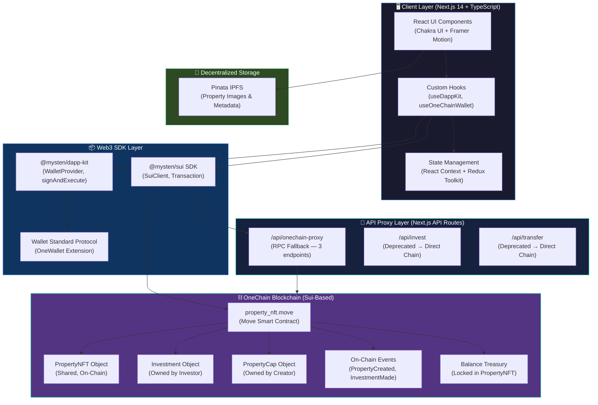
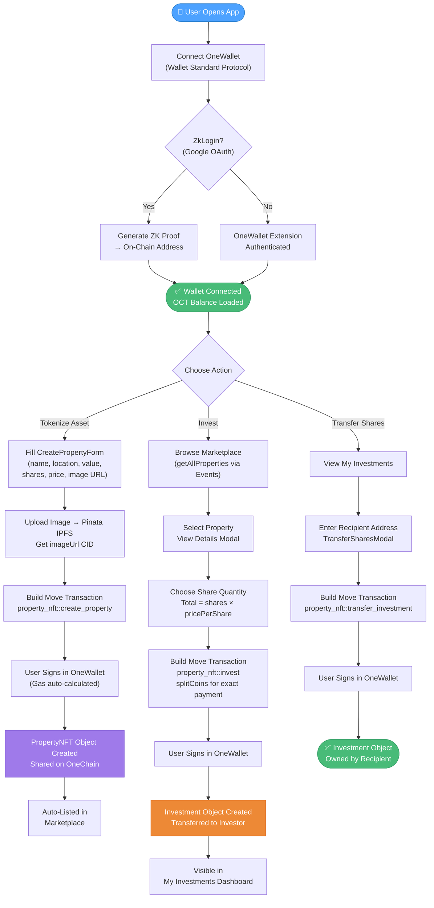
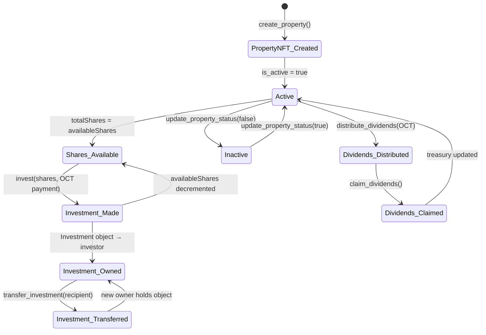

<div align="center">

<!-- HERO BANNER -->


<br/>

# OneRWA Marketplace

### Decentralized Real-World Asset Tokenization & Fractional Ownership Exchange on OneChain

> **Tokenize, fractionalize, and trade real estate and physical assets on-chain — powered by Move smart contracts, ZkLogin, and the OneChain high-performance blockchain.**

<br/>

<!-- BADGES ROW 1: STATUS -->
[](https://rwa-exchange-mantle.vercel.app/)
[](https://youtu.be/your-demo-video)
[](https://github.com/RWA-Exchange/RWA-Exchange-OneChain)
[](https://onescan.cc/testnet/object/0x7b8e0864967427679b4e129f79dc332a885c6087ec9e187b53451a9006ee15f2)

<br/>

<!-- BADGES ROW 2: TECH -->
[](https://nextjs.org/)
[](https://www.typescriptlang.org/)
[](https://sui.io/)
[](https://onechain.network/)
[](https://chakra-ui.com/)
[](https://soliditylang.org/)
[](https://hardhat.org/)
[](https://vitest.dev/)
[](./LICENSE)

</div>

---

## Table of Contents

1. [Executive Summary](#executive-summary)
2. [Live Links & Resources](#live-links--resources)
3. [UI Gallery](#ui-gallery)
4. [Architecture & Data Flow](#architecture--data-flow)
5. [Smart Contract Deep-Dive](#smart-contract-deep-dive)
6. [Technical Feature Breakdown](#technical-feature-breakdown)
7. [Tech Stack](#tech-stack)
8. [Project Structure](#project-structure)
9. [Quick Start](#quick-start)
10. [Environment Variables](#environment-variables)
11. [Smart Contract Deployment](#smart-contract-deployment)
12. [Testing & Verification](#testing--verification)
13. [Security Controls](#security-controls)
14. [Roadmap](#roadmap)
15. [Contributing](#contributing)
16. [License](#license)

---

## Executive Summary

### The Problem

The global real estate market exceeds **$326 trillion** in value, yet it remains one of the most illiquid, gatekept, and geographically fragmented asset classes. Traditional property investment demands six-figure capital, weeks of settlement, opaque fee structures, and geographic restriction — locking out 99% of global investors.

### The Solution

**OneRWA Marketplace** solves this with on-chain fractional ownership. A property worth $1,000,000 is tokenized as a `PropertyNFT` on OneChain, then split into 10,000 fractional `Investment` objects — each purchasable for as little as **0.001 OCT**. Ownership is cryptographically verifiable, transfers settle in seconds, and secondary trading is peer-to-peer with zero custodian risk.

### Performance Benchmarks

| Metric | Value |
|---|---|
| Transaction Finality | ~3–5 seconds on OneChain Testnet |
| Minimum Investment | 1 share / ~0.001 OCT |
| Smart Contract Language | Move (memory-safe, resource-oriented) |
| Gas per Property Creation | ~0.01 OCT |
| Gas per Investment | ~0.05 OCT |
| Test Coverage | 17/17 unit tests passing |
| RPC Fallback Endpoints | 3 (with automatic failover) |
| Supported Wallet Standards | Wallet Standard Protocol |
| ZkLogin Support | Google OAuth → on-chain identity |

---

## Live Links & Resources

| Resource | Link |
|---|---|
| 🌐 Live Marketplace | [rwa-exchange.vercel.app](https://rwa-exchange-mantle.vercel.app/) |
| ▶ Demo Walkthrough | [YouTube Demo Video](https://youtu.be/your-demo-video) |
| 💻 GitHub Repository | [github.com/Aaditya1273/RWA-Exchange](https://github.com/Aaditya1273/RWA-Exchange) |
| 🔍 Deployed Contract | [OneScan Testnet Explorer](https://onescan.cc/testnet/object/0x7b8e0864967427679b4e129f79dc332a885c6087ec9e187b53451a9006ee15f2) |
| 🚰 OCT Faucet | [faucet-testnet.onelabs.cc](https://faucet-testnet.onelabs.cc) |
| 📖 OneChain Docs | [docs.onechain.network](https://docs.onechain.network) |
| 🌍 OneScan Explorer | [onescan.cc/testnet/home](https://onescan.cc/testnet/home) |

---

## UI Gallery

<div align="center">

**Landing Page — Hero & Feature Overview**


<br/>

**Why OneRWA — Value Proposition & Platform Benefits**


<br/>

**Enterprise-Grade Security & Compliance**


<br/>

**Create Property NFT — On-Chain Asset Tokenization**


<br/>

**Investor Dashboard — Portfolio Analytics & Holdings**


</div>

---


## 🏗️ Property NFT Creation → Fractionalization → Listing Flow

### Complete Workflow

```mermaid
flowchart TD
    Start[Start: Real-World Asset] --> Create[1. Create Property NFT]
    
    Create --> CreateDetails[Property Details:<br/>- Name & Description<br/>- Location & Type<br/>- Total Value<br/>- Total Shares<br/>- Price per Share OCT<br/>- Rental Yield]
    
    CreateDetails --> Mint[2. Mint Property NFT]
    Mint --> MintTx[Transaction on OneChain<br/>PropertyNFT Object Created]
    
    MintTx --> Fractional[3. Automatic Fractionalization]
    Fractional --> FracDetails[Fractional Shares:<br/>- Total Shares: 10,000<br/>- Available: 10,000<br/>- Price: 0.001 OCT/share<br/>- Stored On-Chain]
    
    FracDetails --> List[4. Auto-Listed in Marketplace]
    List --> ListDetails[Marketplace Listing:<br/>- Visible to all users<br/>- Real-time availability<br/>- Instant investment ready]
    
    ListDetails --> Invest[5. Users Can Invest]
    Invest --> InvestOptions{Investment Options}
    
    InvestOptions --> BuyShares[Buy Fractional Shares]
    BuyShares --> ShareDetails[Purchase Details:<br/>- Min: 1 share<br/>- Max: Available shares<br/>- Payment in OCT<br/>- Gas: ~0.05 OCT]
    
    ShareDetails --> InvestNFT[Investment NFT Created]
    InvestNFT --> InvestRecord[Investment Record:<br/>- Property ID<br/>- Shares Owned<br/>- Investment Amount<br/>- Timestamp]
    
    InvestRecord --> Portfolio[6. Track in Portfolio]
    Portfolio --> PortfolioView[My Investments Page:<br/>- Total Invested<br/>- Total Shares<br/>- Properties Owned<br/>- Real-time Updates]
    
    PortfolioView --> Transfer[7. Transfer Shares Optional]
    Transfer --> TransferTx[Transfer Investment NFT<br/>to Another User]
    
    TransferTx --> End[End: Complete Ownership Cycle]
    
    style Create fill:#9f7aea,stroke:#805ad5,color:#fff
    style Fractional fill:#38b2ac,stroke:#319795,color:#fff
    style List fill:#ed8936,stroke:#dd6b20,color:#fff
    style Invest fill:#48bb78,stroke:#38a169,color:#fff
    style Portfolio fill:#4299e1,stroke:#3182ce,color:#fff
```




## Architecture & Data Flow

### System Architecture Overview

The platform follows a three-layer architecture: **Next.js Frontend** → **Next.js API Proxy Layer** → **OneChain Move Smart Contracts**. The API proxy layer handles RPC endpoint failover and CORS, while all state transitions and ownership records live entirely on-chain.



---

### End-to-End User Flow



---

### Smart Contract State Machine



---

## Smart Contract Deep-Dive

The core of OneRWA is a single, auditable Move module: `rwa_exchange::property_nft`, deployed on OneChain at:

```
Package ID: 0x7b8e0864967427679b4e129f79dc332a885c6087ec9e187b53451a9006ee15f2
Network:    OneChain Testnet
Deployer:   0x212174e0558a24845ec2d4c3ab5928edbd4450e6625976d3801317a0294ca8aa
```

### Core Objects

| Object | Type | Ownership | Purpose |
|---|---|---|---|
| `PropertyNFT` | `key, store` | **Shared** | Represents the tokenized real-world asset; holds fractional share supply and OCT treasury |
| `Investment` | `key, store` | **Owned** (investor) | Proof of fractional ownership — transferable, tradeable |
| `PropertyCap` | `key, store` | **Owned** (creator) | Admin capability for status updates and dividend distribution |

### Entry Functions

```move
// Tokenize a real-world asset as a PropertyNFT
public entry fun create_property(
    name: vector<u8>,         // Property name
    description: vector<u8>,  // Asset description
    image_url: vector<u8>,    // Pinata IPFS URL
    location: vector<u8>,     // Geographic location
    property_type: vector<u8>,// "Residential", "Commercial", etc.
    total_value: u64,         // USD value in base units
    total_shares: u64,        // Total fractional shares (e.g., 10000)
    price_per_share: u64,     // OCT price in MIST (1 OCT = 1_000_000_000 MIST)
    rental_yield: vector<u8>, // APY string (e.g., "8.5%")
    ctx: &mut TxContext
)

// Purchase fractional shares — exact payment enforced, excess refunded
public entry fun invest(
    property: &mut PropertyNFT,  // Shared object (mutable)
    payment: Coin<OCT>,          // Payment coin split from gas
    shares_to_buy: u64,          // Number of shares
    ctx: &mut TxContext
)

// Transfer Investment NFT to any address (peer-to-peer secondary trading)
public entry fun transfer_investment(
    investment: Investment,
    recipient: address,
    _ctx: &mut TxContext
)

// Distribute rental dividends to treasury (PropertyCap required)
public entry fun distribute_dividends(
    property: &mut PropertyNFT,
    _cap: &PropertyCap,
    dividend_amount: Coin<OCT>,
    ctx: &mut TxContext
)

// Claim proportional dividends based on shares owned
public entry fun claim_dividends(
    property: &mut PropertyNFT,
    investment: &Investment,
    ctx: &mut TxContext
)
```

### On-Chain Events

| Event | Emitted On | Key Fields |
|---|---|---|
| `PropertyCreated` | `create_property` | property_id, name, total_value, total_shares, price_per_share, owner |
| `InvestmentMade` | `invest` | property_id, investor, shares_purchased, amount_paid, timestamp |
| `DividendDistributed` | `distribute_dividends` | property_id, total_amount, per_share_amount |
| `InvestmentListed` | `list_investment_for_sale` | investment_id, seller, shares, asking_price |
| `InvestmentTraded` | `buy_listed_investment` | investment_id, seller, buyer, shares, price |

### Solidity Contracts (EVM / Hardhat — Secondary Path)

For EVM-compatible chains (OneChain EVM, Hardhat localhost), three Solidity contracts are included:

| Contract | Standard | Purpose |
|---|---|---|
| `PropertyNFT.sol` | ERC-721 (OpenZeppelin) | Mints property NFTs on EVM chains |
| `Fractionalizer.sol` | ERC-721 + Ownable, ReentrancyGuard, Pausable | Locks PropertyNFTs, deploys ERC-20 fraction tokens, handles redeem flow |
| `Fraction.sol` | ERC-20 (controlled mint) | Fungible fraction tokens representing partial ownership |

---

## Technical Feature Breakdown

### 1. Zero-Overhead Fractionalization via Move Resource Model

Unlike EVM-based fractionalization (which requires a separate `Fractionalizer.sol` contract to lock an ERC-721 and mint ERC-20 shares), OneRWA's Move implementation builds fractional ownership **directly into the `PropertyNFT` struct**. The `availableShares` and `treasury: Balance<OCT>` fields are resource-typed — the Move VM enforces that no OCT can be created or destroyed without an explicit coin operation. This eliminates the custodial risk present in Solidity-based lockers.

```move
public struct PropertyNFT has key, store {
    id: UID,
    total_shares: u64,
    available_shares: u64,        // Decremented atomically on each invest()
    price_per_share: u64,
    treasury: Balance<OCT>,       // Typed resource — cannot be duplicated or dropped
    ...
}
```

### 2. Exact Payment Enforcement with Automatic Refund

The `invest()` function performs a **split-and-refund** pattern — the exact required amount is split from the payment coin and deposited into treasury, while any overpayment is returned to the investor atomically in the same transaction. This prevents both fund loss and double-spend.

```move
let required_amount = shares_to_buy * property.price_per_share;
let payment_balance = coin::into_balance(payment);
let required_balance = balance::split(&mut payment_balance, required_amount);
balance::join(&mut property.treasury, required_balance);

// Atomic refund of excess OCT — same transaction
if (balance::value(&payment_balance) > 0) {
    let refund_coin = coin::from_balance(payment_balance, ctx);
    transfer::public_transfer(refund_coin, tx_context::sender(ctx));
}
```

### 3. Multi-Endpoint RPC Failover Proxy

OneChain testnet RPC can occasionally be unreliable. The `/api/onechain-proxy` route implements **sequential endpoint fallback** across 3 RPC URLs with a 15-second per-request timeout, ensuring the frontend remains functional even when a primary node is degraded.

```typescript
const RPC_ENDPOINTS = [
  process.env.ONECHAIN_RPC_URL || 'https://rpc-testnet.onelabs.cc:443',
  'https://testnet-rpc.onechain.network',
  'https://rpc-testnet.onelabs.cc',
];
// Tries each endpoint sequentially, returns first success
```


### 4. Dual-Package Property Indexing

The `getAllProperties()` service queries `PropertyCreated` events from **both** the current and legacy package IDs simultaneously, then hydrates each with full on-chain object details. This ensures backward compatibility as the contract evolves.

```typescript
const [newResponse, oldResponse] = await Promise.all([
  client.queryEvents({ query: { MoveEventType: `${PACKAGE_ID}::property_nft::PropertyCreated` } }),
  client.queryEvents({ query: { MoveEventType: `${OLD_PACKAGE_ID}::property_nft::PropertyCreated` } }),
]);
const allEvents = [...newResponse.data, ...oldResponse.data];
```

---

## Tech Stack

### By Layer

| Layer | Technology | Version | Architectural Purpose |
|---|---|---|---|
| **Blockchain** | OneChain (Sui-based) | Testnet/Mainnet | High-throughput, object-centric chain for RWA tokenization |
| **Smart Contracts** | Move Language | — | Memory-safe, resource-oriented asset logic; no re-entrancy by design |
| **Smart Contracts (EVM)** | Solidity | 0.8.24 | EVM-compatible fractionalization for multi-chain support |
| **EVM Tooling** | Hardhat | 2.x | Compile, test, and deploy Solidity contracts to OneChain EVM |
| **EVM Security** | OpenZeppelin Contracts | 5.4.0 | Battle-tested ERC-721, ERC-20, ReentrancyGuard, Pausable, Ownable |
| **Frontend Framework** | Next.js | 14.2.4 | App Router, SSR, API routes as proxy layer |
| **Language** | TypeScript | 5.x | End-to-end type safety across frontend and services |
| **UI Library** | Chakra UI | 2.8.2 | Accessible, themeable component system |
| **Animations** | Framer Motion | 11.x | Micro-interactions and page transitions |
| **Web3 SDK** | @mysten/sui | 1.0.0 | SuiClient, Transaction builder, event queries |
| **Wallet Integration** | @mysten/dapp-kit | 0.14.0 | React hooks for wallet connection and transaction signing |
| **Wallet Protocol** | Wallet Standard | 1.1.0 | Browser-agnostic wallet interface (OneWallet, etc.) |
| **State Management** | Redux Toolkit + React Query | 2.x / 5.x | Global state and server-state synchronization |
| **File Storage** | Pinata IPFS | — | Decentralized storage for property images and metadata |
| **Unit Testing** | Vitest | 1.6.x | Fast, Vite-native test runner for TS/React |
| **Component Testing** | @testing-library/react | 14.x | DOM-based component integration tests |
| **Contract Testing** | Hardhat + Chai | — | Solidity contract unit and integration tests |
| **Logging** | Pino (pino-pretty) | 13.x | Structured, production-safe logging with PII redaction |
| **Linting** | ESLint (Next.js config) | — | Code quality enforcement |
| **CI/CD** | GitHub Actions | — | Automated contract deployment workflow |

---

## Project Structure

```
RWA-Exchange-OneChain/
│
├── sources/                          # Move smart contracts (primary)
│   └── property_nft.move             # Core RWA tokenization contract
│
├── contracts/                        # Solidity smart contracts (EVM path)
│   ├── PropertyNFT.sol               # ERC-721 property token
│   ├── Fractionalizer.sol            # NFT → ERC-20 fractionalization engine
│   └── Fraction.sol                  # ERC-20 fraction token with controlled mint
│
├── scripts/                          # Deployment & utility scripts
│   ├── deploy.ts                     # Hardhat deploy (EVM)
│   ├── deploy-onechain.ts            # OneChain Move deployment
│   ├── deploy-move.ts                # Move package publish script
│   ├── create-sample-properties.js   # Seed marketplace with demo properties
│   └── generate-proofpack.js         # ZkLogin proof generation utility
│
├── src/
│   ├── app/                          # Next.js App Router pages
│   │   ├── page.tsx                  # Landing page (hero, features, CTA)
│   │   ├── collection/               # Marketplace browse & asset detail pages
│   │   ├── create-property/          # Property tokenization form page
│   │   ├── dashboard/                # Portfolio analytics dashboard
│   │   ├── my-investments/           # Investor holdings page
│   │   ├── profile/                  # User profile & wallet info
│   │   └── api/
│   │       ├── onechain-proxy/       # RPC proxy with multi-endpoint failover
│   │       ├── invest/               # Legacy invest route (returns 410)
│   │       ├── investments/          # Legacy investments route (returns 410)
│   │       └── transfer/             # Legacy transfer route (returns 410)
│   │
│   ├── components/                   # Reusable UI components
│   │   ├── CreatePropertyForm.tsx    # Multi-step property tokenization form
│   │   ├── InvestmentModal.tsx       # Share purchase flow modal
│   │   ├── PropertyMarketplace.tsx   # Asset grid with search & filters
│   │   ├── TransferSharesModal.tsx   # P2P investment transfer modal
│   │   ├── WalletConnect.tsx         # Wallet connection UX
│   │   ├── WalletProvider.tsx        # DappKit + Wallet Standard context
│   │   └── shared/                   # Typography, Layout, Card primitives
│   │
│   ├── services/                     # Blockchain interaction layer
│   │   ├── propertyContract.ts       # PropertyContractService (create, invest, transfer, query)
│   │   ├── onechain.ts               # OneChainService singleton + ZkLogin
│   │   ├── database.ts               # SQLite (better-sqlite3) local caching
│   │   └── propertyContractDB.ts     # DB-backed property queries
│   │
│   ├── hooks/                        # Custom React hooks
│   │   ├── useDappKit.ts             # DappKit wallet + transaction hook
│   │   ├── useOneChainWallet.ts      # OneChain-specific wallet hook
│   │   ├── useEnhancedWallet.ts      # Unified wallet abstraction
│   │   └── useMarketplaceContext.tsx # Marketplace state context hook
│   │
│   ├── consts/                       # Configuration constants
│   │   ├── nft_contracts.ts          # Chain IDs, RPC URLs, chain configs
│   │   ├── supported_tokens.ts       # OCT, USDC, USDT coin types
│   │   ├── rwa_contracts.ts          # RWA contract address registry
│   │   └── marketplace_contract.ts   # Marketplace contract address
│   │
│   └── utils/
│       └── secureLogger.ts           # Production-safe logger (PII redaction)
│
├── tests/                            # Test suite
│   ├── property-contract.test.ts     # 17 unit tests — fractionalization & trading
│   ├── components.test.tsx           # React component integration tests
│   ├── setup.ts                      # Vitest config + blockchain mocks
│   └── run-all-tests.js              # Phase 2 test runner
│
├── phase2-plan/                      # Documentation & security reports
│   ├── SECURITY_DOCUMENTATION.md    # Vulnerability analysis & mitigations
│   ├── PHASE2_SUBMISSION_REPORT.md  # Grant submission report
│   └── STATUS_MESSAGE_IMPLEMENTATION.md
│
├── .env.example                      # Environment variable template
├── Move.toml                         # Move package manifest
├── Move.lock                         # Move dependency lockfile
├── hardhat.config.js                 # Hardhat config (OneChain Testnet + Mainnet)
├── next.config.mjs                   # Next.js configuration
├── deployment.json                   # Deployed contract addresses
└── package.json                      # Node.js dependencies and scripts
```

---

## Quick Start

### Prerequisites

| Tool | Version | Install |
|---|---|---|
| Node.js | `>= 18.x` | [nodejs.org](https://nodejs.org) |
| npm | `>= 9.x` | Bundled with Node.js |
| OneChain CLI (`one`) | Latest | [docs.onechain.network](https://docs.onechain.network) |
| OneWallet Extension | Latest | OneChain official website |
| OCT Test Tokens | — | [faucet-testnet.onelabs.cc](https://faucet-testnet.onelabs.cc) |

---

### Step 1 — Clone & Install

```bash
git clone https://github.com/Aaditya1273/RWA-Exchange.git
cd RWA-Exchange-OneChain
npm install
```

### Step 2 — Configure Environment

```bash
cp .env.example .env.local
# Fill in your values (see Environment Variables section below)
```

### Step 3 — Run the Development Server

```bash
npm run dev
# → Open http://localhost:3000
```

### Step 4 — (Optional) Deploy Your Own Move Package

```bash
# Build the Move package
one move build

# Publish to OneChain testnet (requires OCT for gas)
one client publish --gas-budget 100000000

# Copy the Package ID from the output and set in .env.local:
# NEXT_PUBLIC_RWA_PACKAGE_ID=0x<your-package-id>
```

### Step 5 — (Optional) Deploy Solidity Contracts (EVM)

```bash
# Compile Solidity contracts
npm run compile

# Deploy to OneChain EVM testnet
npm run deploy:onechain-testnet

# Deploy to OneChain EVM mainnet
npm run deploy:onechain-mainnet
```

### Step 6 — Seed the Marketplace (Demo)

```bash
# Creates sample property NFTs for testing
node scripts/create-sample-properties.js
```

---

### All Available Scripts

```bash
# Development
npm run dev              # Start Next.js dev server (localhost:3000)
npm run build            # Production build
npm run start            # Run production server
npm run lint             # ESLint check

# Testing
npm run test             # Run all Vitest unit tests (single run)
npm run test:watch       # Vitest in watch mode
npm run test:coverage    # Generate coverage report
npm run test:ui          # Vitest UI dashboard
npm run test:phase2      # Full Phase 2 test suite (unit + component + security)
npm run test:hardhat     # Hardhat Solidity contract tests

# Deployment — Move (OneChain)
one move build                                  # Compile Move package
one client publish --gas-budget 100000000       # Deploy to OneChain

# Deployment — Solidity (EVM)
npm run compile                                 # Compile Solidity
npm run deploy:onechain-testnet                 # EVM testnet deploy
npm run deploy:onechain-mainnet                 # EVM mainnet deploy
npm run deploy:localhost                        # Local Hardhat node deploy

# Verification
npm run verify:onechain-testnet                 # Verify on testnet explorer
npm run verify:onechain-mainnet                 # Verify on mainnet explorer

# Utilities
npm run fund-wallet                             # Fund wallet via faucet
npm run proofpack                               # Generate ZkLogin proof pack
```

---

## Environment Variables

Copy `.env.example` to `.env.local` and fill in the values below.

```env
# ─── OneChain Network ──────────────────────────────────────────────────────────
NEXT_PUBLIC_ONECHAIN_RPC_URL=https://rpc-testnet.onelabs.cc:443
NEXT_PUBLIC_ONECHAIN_FAUCET_URL=https://faucet-testnet.onelabs.cc:443
NEXT_PUBLIC_ONECHAIN_NETWORK=testnet

NEXT_PUBLIC_ONECHAIN_TESTNET_RPC_URL=https://testnet-rpc.onechain.network
NEXT_PUBLIC_ONECHAIN_MAINNET_RPC_URL=https://rpc.onechain.network
NEXT_PUBLIC_ONECHAIN_TESTNET_EXPLORER=https://testnet-explorer.onechain.network
NEXT_PUBLIC_ONECHAIN_MAINNET_EXPLORER=https://explorer.onechain.network

# ─── Move Contract ─────────────────────────────────────────────────────────────
NEXT_PUBLIC_RWA_PACKAGE_ID=0x7b8e0864967427679b4e129f79dc332a885c6087ec9e187b53451a9006ee15f2
NEXT_PUBLIC_PACKAGE_ID=your_package_id_here
NEXT_PUBLIC_SCORES_OBJECT_ID=your_scores_object_id_here

# ─── Hardhat / EVM Deployment ──────────────────────────────────────────────────
PRIVATE_KEY=your_evm_private_key_here
ONECHAIN_TESTNET_RPC_URL=https://rpc-testnet.onelabs.cc:443
ONECHAIN_MAINNET_RPC_URL=https://rpc.mainnet.onelabs.cc:443
ONECHAIN_API_KEY=your_onechain_api_key_here
REPORT_GAS=false

# ─── IPFS / Pinata ─────────────────────────────────────────────────────────────
NEXT_PUBLIC_PINATA_JWT=your_pinata_jwt_token
NEXT_PUBLIC_PINATA_GATEWAY=your_pinata_gateway_url

# ─── ZkLogin (Google OAuth → On-Chain Identity) ────────────────────────────────
NEXT_PUBLIC_GOOGLE_CLIENT_ID=your_google_client_id_here
NEXT_PUBLIC_ZKLOGIN_SALT=your_zklogin_salt_here
NEXT_PUBLIC_ZKLOGIN_PROVER_URL=https://prover-dev.mystenlabs.com/v1
NEXT_PUBLIC_ZKLOGIN_MAX_EPOCH=10
```

> **For Vercel deployment**: Add all `NEXT_PUBLIC_*` variables under **Settings → Environment Variables** in your Vercel project dashboard. Never commit `.env.local` to version control.

---

## Smart Contract Deployment

### Deployed Contracts (OneChain Testnet)

| Contract | Address | Explorer |
|---|---|---|
| `rwa_exchange::property_nft` (Move) | `0x7b8e0864967427679b4e129f79dc332a885c6087ec9e187b53451a9006ee15f2` | [View on OneScan](https://onescan.cc/testnet/object/0x7b8e0864967427679b4e129f79dc332a885c6087ec9e187b53451a9006ee15f2) |

### OneChain Network Configuration

| Parameter | Testnet | Mainnet |
|---|---|---|
| Chain ID (EVM) | `1001` | `1000` |
| Chain Identifier (Move) | `onechain:testnet` | `onechain:mainnet` |
| RPC URL | `https://rpc-testnet.onelabs.cc:443` | `https://rpc.mainnet.onelabs.cc:443` |
| Native Token | OCT | OCT |
| Explorer | [onescan.cc/testnet](https://onescan.cc/testnet/home) | [onescan.cc](https://onescan.cc) |

### Interact with Contracts via CLI

```bash
# Create a property NFT
one client call \
  --package 0x7b8e0864967427679b4e129f79dc332a885c6087ec9e187b53451a9006ee15f2 \
  --module property_nft \
  --function create_property \
  --args "Sunset Villa Estate" "Luxury beachfront property" \
         "https://ipfs.io/ipfs/QmYourImageCID" "Miami Beach, FL" \
         "Residential" 1000000 10000 100 "8.5%" \
  --gas-budget 50000000

# Invest in a property (buy 100 shares)
one client call \
  --package 0x7b8e0864967427679b4e129f79dc332a885c6087ec9e187b53451a9006ee15f2 \
  --module property_nft \
  --function invest \
  --args <PROPERTY_OBJECT_ID> <COIN_OBJECT_ID> 100 \
  --gas-budget 50000000

# Transfer your investment shares
one client call \
  --package 0x7b8e0864967427679b4e129f79dc332a885c6087ec9e187b53451a9006ee15f2 \
  --module property_nft \
  --function transfer_investment \
  --args <INVESTMENT_OBJECT_ID> <RECIPIENT_ADDRESS> \
  --gas-budget 30000000

# Verify deployment
one client objects
one client tx-block <TX_HASH>
```

---

## Testing & Verification

### Test Suite Status

```
📋 Phase 2 Test Results
================================
✅ Property Creation Tests      4/4  PASSED
✅ Investment Logic Tests        4/4  PASSED
✅ Trading Operations Tests      2/2  PASSED
✅ Property Fetching Tests       3/3  PASSED
✅ User Investment Tests         2/2  PASSED
✅ Package Deployment Tests      2/2  PASSED
================================
   Total                        17/17 PASSED ✅
```

### Run Tests

```bash
# All unit tests (single run — CI-friendly)
npm run test

# Watch mode (development)
npm run test:watch

# Coverage report
npm run test:coverage

# Full Phase 2 suite (unit + component + security)
npm run test:phase2

# Solidity contract tests (Hardhat)
npm run test:hardhat
```

### Test Coverage Areas

| Area | Test Type | File |
|---|---|---|
| Property NFT creation & validation | Unit | `tests/property-contract.test.ts` |
| Share purchase & OCT/MIST conversion | Unit | `tests/property-contract.test.ts` |
| Investment NFT transfer & ownership | Unit | `tests/property-contract.test.ts` |
| Invalid input & boundary conditions | Unit (edge cases) | `tests/property-contract.test.ts` |
| Network error & RPC failure handling | Unit (mocked) | `tests/property-contract.test.ts` |
| React component rendering | Integration | `tests/components.test.tsx` |
| Wallet connection flows | Integration | `tests/components.test.tsx` |
| Solidity fractionalize / redeem | Contract | Hardhat test suite |

---

## Security Controls

### Implemented Mitigations

| Threat Vector | Mitigation | Location |
|---|---|---|
| **Re-entrancy** | Move resource model prevents re-entrancy by design; Solidity contracts use OpenZeppelin `ReentrancyGuard` | `property_nft.move`, `Fractionalizer.sol` |
| **Unauthorized property control** | `PropertyCap` object required for admin operations; ownership verified via `tx_context::sender` | `property_nft.move` |
| **Overpayment / fund loss** | Split-and-refund pattern returns excess OCT atomically in the same transaction | `property_nft.move::invest` |
| **Double-spend on shares** | `available_shares` decremented atomically; Move VM enforces no phantom writes | `property_nft.move` |
| **Front-running** | All state changes are atomic in a single transaction block on OneChain | OneChain consensus |
| **Input validation** | Client-side and server-side validation on all form inputs; zero-value guards in Move (`assert!`) | `property_nft.move`, `CreatePropertyForm.tsx` |
| **PII / key leakage in logs** | `secureLogger.ts` automatically redacts wallet addresses and keys in log output | `src/utils/secureLogger.ts` |
| **EVM access control** | `Ownable`, `Pausable`, `onlyOwner` modifiers on all privileged Solidity functions | `Fractionalizer.sol` |
| **Emergency stop** | `pause()` / `unpause()` on Fractionalizer allows owner to halt operations during incidents | `Fractionalizer.sol` |
| **Gas griefing** | Gas budget set explicitly per operation; wallet auto-calculation fallback | `propertyContract.ts` |
| **CORS / proxy injection** | All RPC calls proxied through Next.js API route; no direct browser-to-RPC exposure | `/api/onechain-proxy` |

### Security Notes

> ⚠️ **This project is currently deployed on OneChain testnet for demonstration purposes.** All transactions use test OCT tokens only.

> ⚠️ **A professional third-party security audit is strongly recommended before mainnet deployment.** KYC/AML integration is stubbed and not enforced in the current version.

> ✅ **Phase 2 security requirements are complete**: comprehensive unit testing, production-safe logging, input validation, error handling, and security documentation are all implemented.

### Security Documentation

Full vulnerability analysis, edge case documentation, and incident response procedures are available in [`phase2-plan/SECURITY_DOCUMENTATION.md`](./phase2-plan/SECURITY_DOCUMENTATION.md).

---

## Contributing

Contributions are welcome. Please follow these steps to contribute to OneRWA Marketplace.

### Development Setup

```bash
# 1. Fork the repository on GitHub
# 2. Clone your fork
git clone https://github.com/<your-username>/RWA-Exchange.git
cd RWA-Exchange-OneChain

# 3. Install dependencies
npm install

# 4. Create a feature branch
git checkout -b feat/your-feature-name

# 5. Start the dev server
npm run dev
```

### Contribution Guidelines

- **Branch naming**: Use `feat/`, `fix/`, `docs/`, or `chore/` prefixes
- **Commits**: Follow [Conventional Commits](https://www.conventionalcommits.org/) — e.g., `feat: add dividend claim button`
- **Tests**: Add or update tests for any new functionality (`npm run test`)
- **Lint**: Ensure no lint errors before submitting (`npm run lint`)
- **Move contracts**: Any changes to `property_nft.move` must include updated unit tests and be re-deployed to testnet

### Pull Request Process

1. Ensure all tests pass: `npm run test`
2. Update documentation if you change behavior
3. Open a PR against the `main` branch with a clear description of changes
4. Reference any related issues with `Closes #<issue-number>`
5. A maintainer will review and merge your PR

### Reporting Issues

Please use GitHub Issues to report bugs or request features. Include:
- A clear description of the problem
- Steps to reproduce
- Expected vs. actual behavior
- Your environment (OS, Node version, browser, wallet version)

---

## Troubleshooting

### Common Issues

**OneWallet "Sign" button disabled**

This occurs when the transaction object is missing gas data. The fix is to pass the `Transaction` object (not bytes) to the wallet, with gas owner explicitly set:

```typescript
transaction.setGasOwner(address);
await transaction.build({ client });
// Pass Transaction object — not transaction.build bytes
await wallet.signAndExecuteTransaction({ transaction, account, chain: 'onechain:testnet' });
```

**RPC timeout / connection refused**

The `/api/onechain-proxy` route automatically retries across 3 endpoints. If all fail, the OneChain testnet may be experiencing downtime. Check the status and retry in a few minutes.

**"Insufficient funds" on invest**

Ensure your wallet has at least `(shares × pricePerShare) + 0.05 OCT` for gas. Get test OCT from the [faucet](https://faucet-testnet.onelabs.cc).

**Properties not loading**

The marketplace queries `PropertyCreated` events from the RPC node. If it loads empty, the RPC may be lagging. Refresh the page or check [OneScan](https://onescan.cc/testnet/home).

**Build fails with TypeScript errors**

```bash
# Clear Next.js cache and rebuild
rm -rf .next
npm run build
```

---

## Acknowledgements

- [OneChain](https://onechain.network/) — the blockchain infrastructure powering this platform
- [Mysten Labs](https://mystenlabs.com/) — creators of the Sui/Move SDK and ZkLogin
- [OpenZeppelin](https://openzeppelin.com/) — battle-tested smart contract libraries
- [Chakra UI](https://chakra-ui.com/) — accessible React component library
- [Framer Motion](https://www.framer.com/motion/) — animation library
- [Pinata](https://pinata.cloud/) — IPFS pinning for NFT metadata and images


---

<div align="center">

**Built with ❤️ for the OneChain ecosystem**

[🌐 Live App](https://rwa-exchange.vercel.app) · [▶ Demo Video](https://youtu.be/your-demo-video) · [💻 GitHub](https://github.com/Aaditya1273/RWA-Exchange) · [🔍 Contract Explorer](https://onescan.cc/testnet/object/0x7b8e0864967427679b4e129f79dc332a885c6087ec9e187b53451a9006ee15f2) · [🚰 OCT Faucet](https://faucet-testnet.onelabs.cc)

</div>
